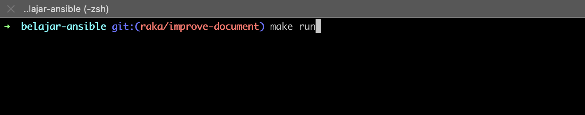
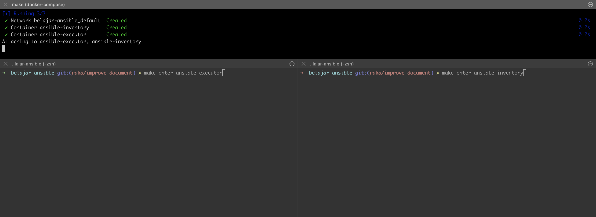
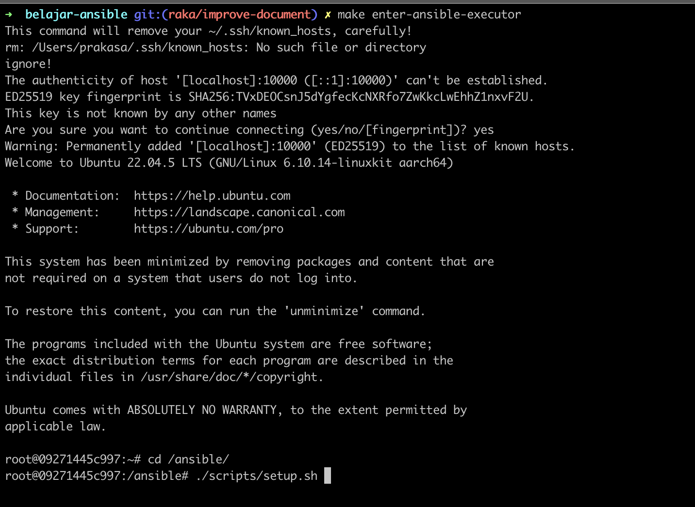
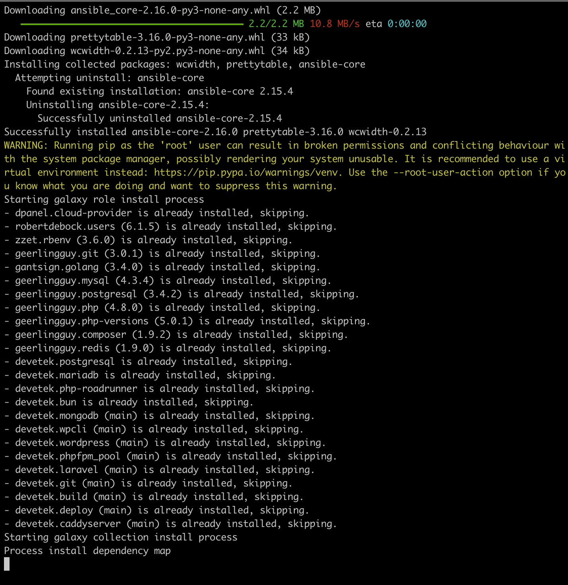
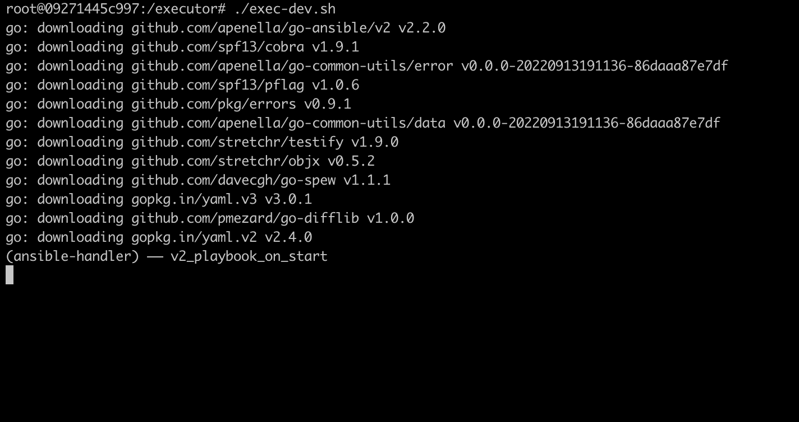
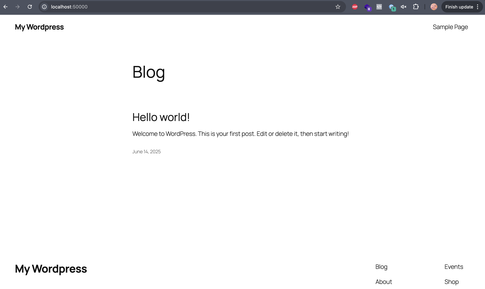

## Deskripsi
Repository untuk belajar ansible dalam bahasa Indonesia dengan contoh (_maaf kalau bahasanya berantakan_). Disini akan menjadi playground ansible yang dapat dijalankan di local mesin kalian dengan sedikit sentuhan docker.

Kenapa docker ? dengan docker, kamu tidak perlu melakukan instalasi binary langsung ke mesin. Sehingga dapat dipastikan ini akan berjalan ke semua platform (macOS, Linux, Windows). Namun karena untuk mempermudah commands, repository ini akan dibungkus dengan `Makefile`. Sehingga mungkin tidak akan berjalan dengan lancar di Windows. Untuk pengguna windows mohon menggunakan command `docker compose` secara langsung.

## Sebelum Mulai
Sebelum mulai pastikan kamu sudah memiliki pengetahuan dasar tentang system operasi, Makefile dan docker. Silahkan belajar di [belajar-docker](https://github.com/devetek/belajar-docker).

Binary Details:
- Ansible Core: 2.15.4

## Bantuan
Untuk mempermudah proses development, di dalam repository ini terdapat beberapa command bantuan yang dapat dijalankan dengan `Makefile`:

```sh
 ____       _        _                   _              _ _     _
| __ )  ___| | __ _ (_) __ _ _ __       / \   _ __  ___(_) |__ | | ___
|  _ \ / _ \ |/ _` || |/ _` | '__|____ / _ \ | '_ \/ __| | '_ \| |/ _ \
| |_) |  __/ | (_| || | (_| | | |_____/ ___ \| | | \__ \ | |_) | |  __/
|____/ \___|_|\__,_|/ |\__,_|_|      /_/   \_\_| |_|___/_|_.__/|_|\___|
                  |__/

Copyright (c) 2025 Devetek Tech. https://devetek.com.
Repo: https://github.com/devetek/belajar-ansible

Use: make <target>

GENERIC
  help                                                Show available commands

DEVELOPMENT
  init                                                Prepare env
  run                                                 Run playground
  ls                                                  Show containers
  enter-ansible-executor                              Enter to ansible-executor
  enter-ansible-inventory                             Enter to ansible-inventory
  log                                                 Show containers log
  down                                                Shutdown playground

DOCKER
  docker-build-push                                   Build and push ansible master

ANSIBLE
  ansible-setup                                       Create new role ansible_role_name=<ROLE_NAME>
  ansible-create-roles                                Create new role ansible_role_name=<ROLE_NAME>
  ansible-install-deps                                Install dependencies from requirements.yml
```

## Daftar Isi
- Kenapa Ansible
- Cara Memulai
- Configurasi Dasar
- Apa Itu Playbook
- Apa Itu Roles
- Apa Itu Collections
- Remote Dependencies
- Praktek Video Youtube

### Kenapa Ansible
Ansible adalah sebuah _provisioning tool_ yang dikembangkan oleh RedHat. Dimana kamu dapat mencatat setiap proses _deployment_ ataupun konfigurasi yang biasa dilakukan berulang - ulang terhadap beberapa _server_ dan membuatnya identik ke semua server.

Bayangkan jika kamu mau melakukan instalasi PHP, MySQL, Apache dan sebagainya. Jika melakukannya ke satu server mungkin hal itu akan mudah dilakukan. Namun jika server yang kamu kelola mulai banyak, ini pasti akan menjadi sangat sulit untuk membuatnya identik.

### Cara Memulai
Untuk menggunakan repository ini jalankan perintah `make run`.



Perintah tersebut akan melakukan beberapa hal:

- Menjalankan docker compose dari file `docker-compose.yml`
- Menjalankan 2 buah container, satu container sebagai ansible executor dan container kedua sebagai ansible inventory

Buka 2 terminal lain, untuk masuk ke container `ansible-executor` dengan perintah `make enter-ansible-executor`. Dan masuk ke container `ansible-inventory` dengan perintah `make enter-ansible-inventory`.



Di dalam container `ansible-executor` masuk ke folder `/ansible` dengan perintah `cd /ansible`. Kemudian jalankan perintah `./scripts/setup.sh` yang di dalamnya menjalankan perintah `ansible-galaxy install -r requirements.yml` untuk menginstall ansible dependencies.





Kemudian pindah ke folder `/executor` dengan perintah `cd /executor`. Kemudian jalankan perintah `go mod tidy` untuk menginstall golang dependencies. Di dalam folder ini juga terdapat contoh untuk menjalankan ansible playbook untuk membuat wordpress ke server `ansible-inventory` (_di repository ini target servernya adalah docker container_) di file `/executor/exec.sh`. Yang berisi:

```sh
#!/usr/bin/bash

export SLACK_WEBHOOK_URL="https://hooks.slack.com/services/fake-app/fake-group/fake-id"
export SLACK_CHANNEL="#dpanel-resource"
export SLACK_USERNAME="dPanel-Creator"

go run main.go -i /ansible/inventory/ansible-inventory.ini -p /ansible/playbooks/bundle-wordpress.yml -u root -k /executor/id_rsa_fake -t all -e @/executor/variables/bundle-wordpress.json
```

Jalankan perintah `./exec.sh` di dalam folder `/executor` untuk membuat situs wordpress dengan detail variable yang berada di file `/executor/variables/bundle-wordpress.json`.



Setelah proses selesai kamu akan memiliki site wordpress yang dapat diakses di `http://localhost:50000`.



> Untuk dapat berjalan 100% (_termasuk mengirim notifikasi ke slack_) ubah environment variable `SLACK_WEBHOOK_URL` menjadi slack hook url asli. Buat slack web hook disini: [Slack App](https://api.slack.com/apps).


Selanjutnya kamu dapat mulai melakukan membuat playbook lain atau modifikasi file-file ansible lainnya (inventory, playbook, roles, etc) yang ada di repository di dalam folder `ansible`.

## Configurasi Dasar
Konfigurasi dasar berada di file `ansible/ansible.cfg`.

## Apa Itu Playbook
Playbook adalah file berformat YAML (.yml) yang digunakan untuk tempat penulisan peraturan / langkah-langkah yang akan dijalankan ke dalam server tujuan. Contoh penggunaan playbook digunakan untuk:
- Mengotomatisasi instalasi software
- Mengkonfigurasi sistem (Linux, Windows)
- Menyebarkan aplikasi
- Menjalankan skrip atau perintah secara terstruktur ke banyak server sekaligus

Kelebihan Ansible Playbook:
- Deklaratif: Anda menyatakan apa yang Anda inginkan, bukan bagaimana mencapainya
- Repeatable dan Idempotent: Bisa dijalankan berulang kali tanpa menyebabkan kerusakan
- Human-readable: Ditulis dalam YAML, mudah dipahami
- Versatile: Bisa digunakan untuk provisioning, deployment, konfigurasi, dsb.